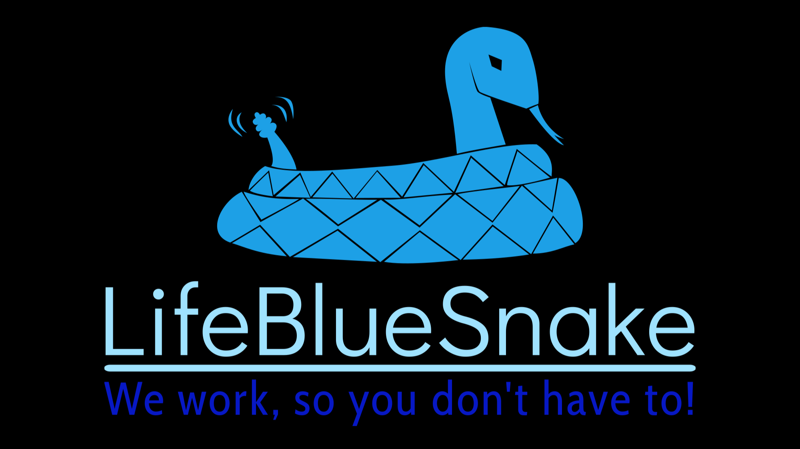
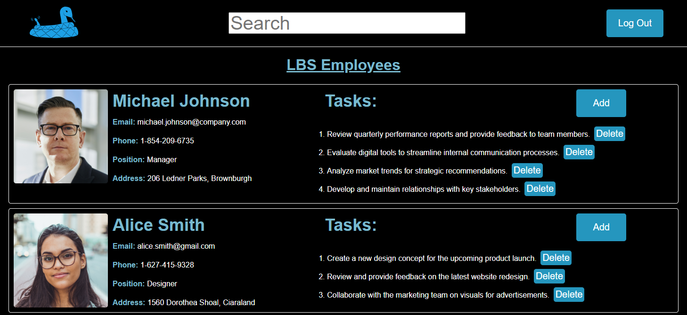

# LifeBlueSnake - Electron App

<kbd>
  
</kbd>

## Introduction

**LifeBlueSnake** is a cross-platform desktop application created using JavaScript and Electron framework. It was created as an additional school project, with a focus on developing an application centered around a theme of my choice. This marks my first significant project, showcasing my skills in software development.

The primary purpose of **LifeBlueSnake** is to facilitate efficient task assignment within organizational settings. The application is designed to streamline the process of distributing and managing tasks among team members. One of its notable features is its cross-platform compatibility, allowing users to access and utilize the application seamlessly on various operating systems.

To enhance user convenience, **LifeBlueSnake** is packaged as an executable, eliminating the need for a traditional installation process. This approach ensures that users can easily integrate the application into their workflow without any unnecessary complications.

In summary, **LifeBlueSnake** serves as a user-friendly solution for organizations seeking a straightforward and effective tool for task assignment. Its cross-platform nature and executable packaging make it a versatile choice for teams operating on different operating systems.

## Features

- **Efficient Task Assignment:** Streamline task assignment within your organization effortlessly.
- **Employee Management:** Access and manage employee information in the centralized database.
- **Real-time Updates:** Changes made, including task assignments or removals, are instantly reflected and persist.
- **User-friendly Interface:** Navigate through the application seamlessly with an intuitive and user-friendly design.
- **Search Functionality:** Easily search for employee data and tasks using the dedicated search field.

<kbd>
  
</kbd>

## Getting Started

1. Clone the repository to your local machine.
2. Navigate to the project directory.
3. Double-click on **LifeBlueSnake.exe** to launch the app.

## Usage

1. **Login Credentials:**
Upon launching LifeBlueSnake, prominently emphasize the use of the login credentials:
    - **Username:** `Nalim`
    - **Password:** `1234`

3. **Database Access:**
Users have direct access to the employee database, empowering them to assign specific tasks or remove existing ones.

4. **Persistent Data:**
The app ensures persistent data storage, guaranteeing that any changes made by users are retained even after logging out or closing the application.

5. **Search Functionality:**
At the top of the application window, users will find a search field. This functionality enables users to find information about employees and their tasks by entering specific keywords, such as a name, city, or task. The results are dynamically displayed, making it easy for users to locate relevant information quickly.

## Prototype Disclaimer

Please note that LifeBlueSnake is a prototype created as an additional school assignment and is not intended for use by other companies. While its functionality closely resembles real applications designed for this purpose, it serves primarily as a demonstration of skills and knowledge acquired during the development process.

## License

This project is licensed under the terms of the MIT license.

The large files in this repository are managed using Git LFS (Large File Storage). Git LFS is licensed under its own terms, and the license file can be found at [LICENSE.md](https://media.githubusercontent.com/media/NalimWeso/lifebluesnake-electron-app/main/LICENSE.md).
